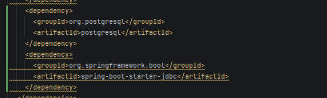
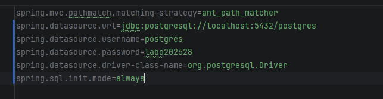
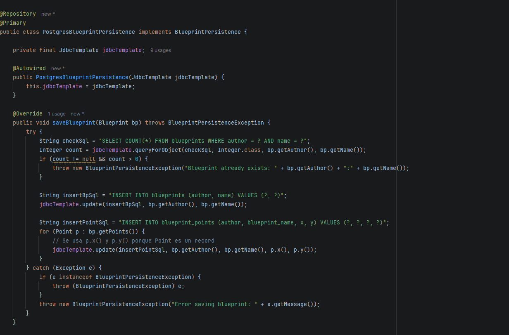
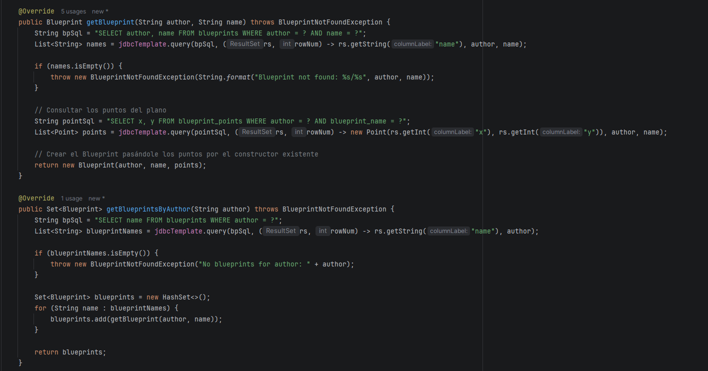
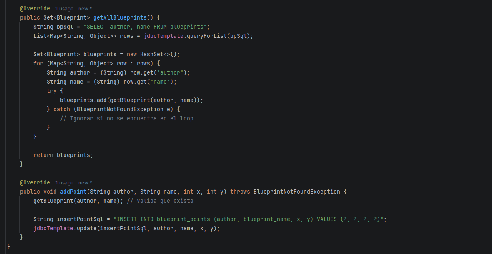
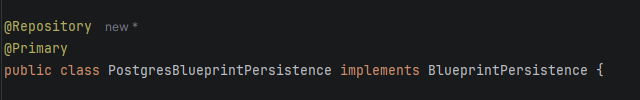

## Laboratorio #4 – REST API Blueprints (Java 21 / Spring Boot 3.3.x)
# Escuela Colombiana de Ingeniería – Arquitecturas de Software  

## Marco Alvarez - Andres Sabogal

---

## 📋 Requisitos
- Java 21
- Maven 3.9+

## ▶️ Ejecución del proyecto
```bash
mvn clean install
mvn spring-boot:run
```
Probar con `curl`:
```bash
curl -s http://localhost:8080/api/v1/blueprints | jq
curl -s http://localhost:8080/api/v1/blueprints/john | jq
curl -s http://localhost:8080/api/v1/blueprints/john/house | jq
curl -i -X POST http://localhost:8080/api/v1/blueprints -H 'Content-Type: application/json' -d '{ "author":"john","name":"kitchen","points":[{"x":1,"y":1},{"x":2,"y":2}] }'
curl -i -X PUT  http://localhost:8080/api/v1/blueprints/john/kitchen/points -H 'Content-Type: application/json' -d '{ "x":3,"y":3 }'
```
> Si deseas activar filtros de puntos (reducción de redundancia, *undersampling*, etc.), implementa nuevas clases que implementen `BlueprintsFilter` y cámbialas por `IdentityFilter` con `@Primary` o usando configuración de Spring.
---

Abrir en navegador:  
- Swagger UI: [http://localhost:8080/swagger-ui.html](http://localhost:8080/swagger-ui.html)  
- OpenAPI JSON: [http://localhost:8080/v3/api-docs](http://localhost:8080/v3/api-docs)  

---

## 🗂️ Estructura de carpetas (arquitectura)

```
src/main/java/edu/eci/arsw/blueprints
  ├── model/         # Entidades de dominio: Blueprint, Point
  ├── persistence/   # Interfaz + repositorios (InMemory, Postgres)
  │    └── impl/     # Implementaciones concretas
  ├── services/      # Lógica de negocio y orquestación
  ├── filters/       # Filtros de procesamiento (Identity, Redundancy, Undersampling)
  ├── controllers/   # REST Controllers (BlueprintsAPIController)
  └── config/        # Configuración (Swagger/OpenAPI, etc.)
```

> Esta separación sigue el patrón **capas lógicas** (modelo, persistencia, servicios, controladores), facilitando la extensión hacia nuevas tecnologías o fuentes de datos.

---

## 📖 Actividades del laboratorio

### 1. Familiarización con el código base
- Revisa el paquete `model` con las clases `Blueprint` y `Point`.  
- Entiende la capa `persistence` con `InMemoryBlueprintPersistence`.  
- Analiza la capa `services` (`BlueprintsServices`) y el controlador `BlueprintsAPIController`.

### 2. Migración a persistencia en PostgreSQL

- Configura una base de datos PostgreSQL (puedes usar Docker).  
R/ Para levantar la base de datos PostgreSQL requerida para el funcionamiento de la aplicación, utilizamos el siguiente comando en la terminal:

```bash
docker run --rm --name postgres-dev -e POSTGRES_USER=postgres -e POSTGRES_PASSWORD=labo202628 -e POSTGRES_DB=postgres-dev -p 5432:5432 -d postgres:16
```
Ademas de agregar su respectiva dependencia en el xml y en properties



- Implementa un nuevo repositorio `PostgresBlueprintPersistence` que reemplace la versión en memoria.
R/ PostgresBlueprintPersistence: Se creó una nueva implementación de la interfaz BlueprintPersistence utilizando Spring JdbcTemplate para realizar las consultas y operaciones directamente sobre PostgreSQL.







- Mantén el contrato de la interfaz `BlueprintPersistence`.  
R/ Para asegurar que la arquitectura y las pruebas existentes no se rompan, la nueva clase respeta y implementa estrictamente todos los métodos definidos en el contrato original de la interfaz BlueprintPersistence.


### 3. Buenas prácticas de API REST
- Cambia el path base de los controladores a `/api/v1/blueprints`.  
- Usa **códigos HTTP** correctos:  
  - `200 OK` (consultas exitosas).  
  - `201 Created` (creación).  
  - `202 Accepted` (actualizaciones).  
  - `400 Bad Request` (datos inválidos).  
  - `404 Not Found` (recurso inexistente).  
- Implementa una clase genérica de respuesta uniforme:
  ```java
  public record ApiResponse<T>(int code, String message, T data) {}
  ```
  Ejemplo JSON:
  ```json
  {
    "code": 200,
    "message": "execute ok",
    "data": { "author": "john", "name": "house", "points": [...] }
  }
  ```
R/ Se cambió el @RequestMapping del controlador de /blueprints a /api/v1/blueprints. Se creó el record edu.eci.arsw.blueprints.dto.ApiResponse<T> y todos los endpoints retornan sus datos o el error envueltos en esa estructura. Códigos HTTP:

| Endpoint | Éxito | Error |
|---|---|---|
| GET /api/v1/blueprints | 200 | — |
| GET /api/v1/blueprints/{author} | 200 | 404 (sin planos) |
| GET /api/v1/blueprints/{author}/{bpname} | 200 | 404 (no existe) |
| POST /api/v1/blueprints | 201 | 400 (datos inválidos o duplicado) |
| PUT /api/v1/blueprints/{author}/{bpname}/points | 202 | 404 (no existe) |

Se agregó @ExceptionHandler(MethodArgumentNotValidException.class) para responder 400 con el detalle del campo inválido en el POST.

### 4. OpenAPI / Swagger
- Configura `springdoc-openapi` en el proyecto.  
- Expón documentación automática en `/swagger-ui.html`.  
- Anota endpoints con `@Operation` y `@ApiResponse`.

R/ La dependencia springdoc-openapi-starter-webmvc-ui ya esta en el pom.xml junto con OpenApiConfig. Se anotó cada endpoint con @Operation y @ApiResponses (usando el nombre completo io.swagger.v3.oas.annotations.responses.ApiResponse para evitar choque con nuestro propio ApiResponse<T>). Se agregó @Tag a nivel de clase. Resultado:
- Swagger UI: http://localhost:8080/swagger-ui.html
- OpenAPI JSON: http://localhost:8080/v3/api-docs

### 5. Filtros de *Blueprints*
- Implementa filtros:
  - **RedundancyFilter**: elimina puntos duplicados consecutivos.  
  - **UndersamplingFilter**: conserva 1 de cada 2 puntos.  
- Activa los filtros mediante perfiles de Spring (`redundancy`, `undersampling`).  

R/ Se implementaron filtros para procesar y optimizar los puntos de los planos bajo la interfaz `BlueprintsFilter`:

* **RedundancyFilter**: Elimina los puntos consecutivos duplicados $(x,y)$. Se activa con el perfil: `spring.profiles.active=redundancy`.
* **UndersamplingFilter**: Conserva 1 de cada 2 puntos para reducir la densidad del plano. Se activa con el perfil: `spring.profiles.active=undersampling`.
* **IdentityFilter**: Filtro por defecto que no altera el plano si no se especifica ningún perfil.

### Cómo probarlo:
Modifica la siguiente línea en tu archivo `src/main/resources/application.properties` con el filtro que deseas evaluar:
```properties
spring.profiles.active=redundancy
```

---

## ✅ Entregables

1. Repositorio en GitHub con:  
   - Código fuente actualizado.  
   - Configuración PostgreSQL (`application.yml` o script SQL).  
   - Swagger/OpenAPI habilitado.  
   - Clase `ApiResponse<T>` implementada.  

2. Documentación:  
   - Informe de laboratorio con instrucciones claras.  
   - Evidencia de consultas en Swagger UI y evidencia de mensajes en la base de datos.  
   - Breve explicación de buenas prácticas aplicadas.  

---

## 📊 Criterios de evaluación

| Criterio | Peso |
|----------|------|
| Diseño de API (versionamiento, DTOs, ApiResponse) | 25% |
| Migración a PostgreSQL (repositorio y persistencia correcta) | 25% |
| Uso correcto de códigos HTTP y control de errores | 20% |
| Documentación con OpenAPI/Swagger + README | 15% |
| Pruebas básicas (unitarias o de integración) | 15% |

**Bonus**:  

- Imagen de contenedor (`spring-boot:build-image`).  
- Métricas con Actuator.  